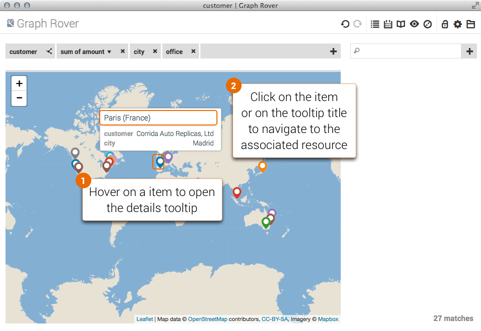

---
title:	    Search and Analysis Tutorial
excerpt:    Hands-on guided tour of self-service search and analysis tools
---

# Getting Started

This example-driven tutorial introduces the self-service search and analysis tools of the [Metreeca](https://www.metreeca.com/platform/) model-drive linked data platform. Basic familiarity with [business intelligence](http://en.wikipedia.org/wiki/Business_intelligence) and  [linked data](http://www.w3.org/standards/semanticweb/data) concepts is useful, but not required.

To get started open [https://demo.metreeca.com/apps/self/](https://demo.metreeca.com/apps/self/#endpoint=https://demo.metreeca.com/sparql) with a [supported](../../handbooks/installation#system-requirements) web browser and connect to a SPARQL endpoint.

The tutorial refers to the [https://demo.metreeca.com/sparql](https://demo.metreeca.com/apps/self/#endpoint=https://demo.metreeca.com/sparql) endpoint, which serves a semantic version of the [BIRT](http://www.eclipse.org/birt/phoenix/db/) sample dataset, cross-linked to [GeoNames](http://www.geonames.org/) entities for cities and countries. The BIRT sample is a typical business database, containing tables such as *offices*, *customers*, *products*, *orders*, *order lines*, … for *Classic Models*, a fictional world-wide retailer of scale toy models.

Should you want to try out Metreeca on your own datasets, for best results make sure to review [data usability](../../how-tos/improve-user-experience#data-usability) guidelines.

You may also try out Metreeca on DBpedia and other LOD endpoints: if you feel like, have a look at [https://www.metreeca.com/demos](https://www.metreeca.com/demos#analytics).

The demo server is hosted on a cloud service: it is not expected to provide production-level performance and may experience some delays during on-demand workspace initialization.

## Connecting to an Endpoint

Enter the URL of the endpoint ([https://demo.metreeca.com/sparql](https://demo.metreeca.com/apps/self/#endpoint=https://demo.metreeca.com/sparql)) in the *base* field of the report info dialog (or just click the link if you feel lazy ;-): subsequent queries will automatically configure themselves with the least recently used endpoint.

To connect to a different endpoint, click on the *Connect To…* command in the *Manage* menu of the toolbar.

## Opening a Collection

# Fields and Facets

## Adding Fields

## Adding Facets

## Turning Fields into Facets

## Filtering Matches

As you enter constraints, the other facets automatically update their values to show the available options and the current range.

## Sorting Fields

## Turning Facets into Fields

## Rearranging Fields and Facets

# Linked Data Navigation

## Browsing Linked Resources

## Browsing Linked Resource Sets

# Set-Based Navigation

## Opening a Related Set

## Traversing Graph Paths

 In the most general case, fields, facets and related sets are defined by **property paths**, defined from a starting set using the property selection dialog. The selection interface is divided into three sections:

-   middle › starting set and properties included in the current path;
-   right › forward properties that may be appended to the current path;
-   left › backward properties that may be appended to the current path.

As you append properties to the path, panels are updated to show the current selection and available further steps.

# Summaries and Transforms

## Summarizing Values

## Transforming Values

## Working with Computed Values

# Charts and Maps

## Visualizing Sets as Charts

## Configuring Charts

## Visualizing Sets on Maps

## Managing Data Series

## Exploring Chart Items

# Browsing History

Linked Data and set-based navigation is recorded in the browser history.

# Managing Reports

Reports are persistently archived on your PC using the local storage provided by the browser.

## Saving Reports

## Exporting Reports

## Locking Reports

# Exporting Data

## Exporting Tables

Note that some versions of Excel won't correctly open the exported CSV file: if this is the case, import it manually from Excel *Data* menu.
